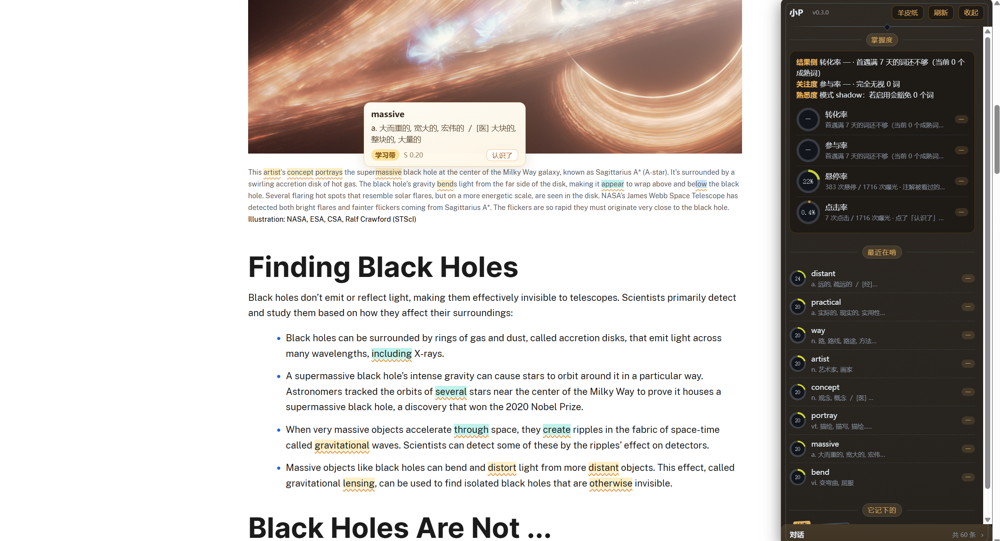
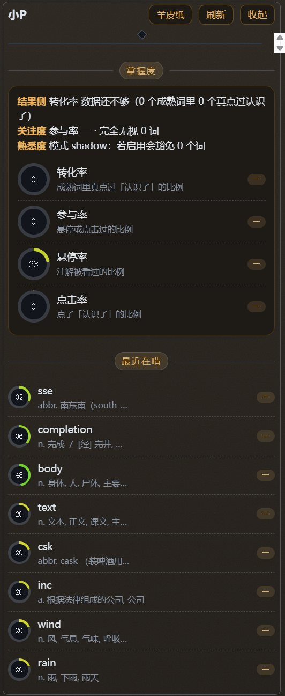

# OpenGloss

**被动英语习得引擎（Passive Acquisition Engine）——读英文网页时，词汇自己长进脑子里。**

> 阶段版本 **v0.3.0**（2026-10）｜Windows 优先（提供 .bat 脚本），Linux/macOS 可用等价的 uvicorn 命令（见下）

OpenGloss 不给你安排任何学习任务。你像平常一样读 GitHub README、技术文档、论文、论坛——它把生词自动标注出来，鼠标悬停就是释义，觉得会了点一下「认识了」。仅此而已。没有课程表，没有打卡，没有测验，没有复习卡片。

英语是阅读的副产品，不是阅读之外的任务。

> **English summary** — A passive vocabulary acquisition engine for reading English on the web: unknown words get
> annotated inline while you read, and you simply click "I know it" when you do. No flashcards, no quizzes, no streaks.
> Local-first: everything lives in a single SQLite file on your machine, with zero telemetry. Built for people who read
> English tech content daily and want vocabulary to accumulate as a by-product. (Currently Windows-first; the engine
> itself is cross-platform.)

## 它长什么样


*在真实英文网页上（图为 NASA 的黑洞科普页，公有领域）：生词自动标注——琥珀=生词、蓝=学习带、青=快出带，颜色就是你对这个词的熟悉度；右侧栏实时显示掌握度指标与最近在啃的词，左上是角色名与版本号。*



*鼠标停在被标词上：悬停卡给出释义、当前熟悉度（S 值）与「认识了」按钮——这是 OpenGloss 唯一的主动动作。上面两张也顺带演示了主题切换（羊皮纸 / 暗夜）。*



*侧栏特写：上部「掌握度」是转化率 / 参与率 / 悬停率 / 点击率四项指标（各带样本量），下部「最近在啃」是最近接触的词、熟悉度圆环与释义；左上角是角色名与扩展版本号。*

打开任意英文网页，几秒后：

- **三色标注**自动出现：🟡 生词（琥珀）/ 🔵 学习带（蓝）/ 🟢 快出带（青）——颜色就是你对这个词的熟悉度
- **悬停卡**：释义 + 当前熟悉度 S 值 + 「认识了」按钮，250px 小卡不挡正文
- **右下角小P**：常驻角色胶囊，点开侧栏看学习状态、最近在啃的词、它记住的事；能聊天，有长期记忆
- 每个内容块最多标 8 个词（长文按 ~1400 字符分块，**整页上限 40**）——**阅读节奏是圣域，宁少勿多**

## 为什么它不一样

| | 市面产品 | OpenGloss |
|---|---|---|
| 触发方式 | 你主动打开 App | 读网页自动发生 |
| 测验 | 单词卡、选择题 | **无任何测验**；「认识了」是唯一主动动作 |
| 数据模型 | 黑盒进度条 | 事件溯源：每次遭遇/悬停/点击都是不可变事件，熟悉度由重放得出 |
| 算法透明度 | 服务端随时改 | 内核语义冻结（哈希校验），每个参数有名字、区间和理由 |
| AI 角色 | 客服/激励师 | 有界自主：改参数必须临时且限幅，用户写的事实 AI 永远不能抹 |

核心信念：**语言习得靠的是大量可理解输入，不是刻意练习。** OpenGloss 做的全部事情，就是把「可理解」这三个字自动化——在你本来就要读的内容上，把陌生的变成熟悉的。

## 快速开始

需要 Python 3.10+。引擎内核纯标准库；API 层依赖 fastapi/pydantic/uvicorn（`pip install -r requirements.txt`）。

> ⚠️ **装 Python 时请勾选 Add python.exe to PATH**（官方安装器**默认不勾**）。忘了勾的话，四个 `.bat` 会直接报错提示你，不会假装成功——但引擎起不来。
> 另：Windows 应用商店那个 `python` 是占位冒牌货——`where python` 找得到它，但它跑不了任何脚本（退出码非零）。
> 所以脚本判真伪看的是 `python --version` 的**退出码是否为 0**，而不是 `where` 找不找得到。

### 1. 拿到词典（**第一次用必须先做这步**）

词典（65 MB）不入库，二选一：

**方式一（省事·推荐）**：从 [Releases](https://github.com/luomeii/OpenGloss/releases/latest) 下载构建好的 `dict.sqlite`，
放进 `resources/ECDICT/` 即可——不用下 63 MB 的 csv，也不用等构建。

**方式二（自己构建）**：

```bash
# 取 ECDICT 的 csv（MIT 许可，作者 skywind3000）——浅克隆最省事：
git clone --depth 1 https://github.com/skywind3000/ECDICT /tmp/ecdict
cp /tmp/ecdict/ecdict.csv resources/ECDICT/
# 然后在仓库根目录构建（约 1-2 分钟）：
python scripts/build_dict.py --csv resources/ECDICT/ecdict.csv --out resources/ECDICT/dict.sqlite
```

两条路产出的词典等价：77 万词条 + 5.8 万变形映射。详见 [resources/ECDICT/README.md](resources/ECDICT/README.md)。

> ⚠️ **没有词典就起引擎的话**：引擎能起来，但 /v1/health 会返回 **503 + `ok:false`**，
> 并带上 `hint` 告诉你缺什么；/v1/annotate 也会 500。所以务必先做这一步。
> （旧版 health 在这种情况下会撒谎说 ok:true，已修。）

### 2. 起引擎

```bash
cd pae
start_engine.bat        # 或: python -m uvicorn pae_core.api:app --port 4815
```

`start_engine.bat` 固定监听 4815，而且会**核对端口上那个引擎用的是不是本目录的 `pae.db`**：
本目录的库 → `engine ready`；别人的库 → 立刻报 ERROR 并 `exit 1`（不会让你以为起好了）。
要换端口或端口被别的程序占用时，直接用右边的 uvicorn 命令并改 `--port`。

> **Linux / macOS**：四个 .bat（start/stop/status/backup）是 Windows 专用，请直接用
> `python -m uvicorn pae_core.api:app --port 4815` 起引擎，停止就 Ctrl-C。其余步骤完全一样。

验证：http://127.0.0.1:4815/v1/health 返回 `{"ok":true}`。
**首次启动要加载 65 MB 词典，约 25 秒**（机器忙时更久）——这期间 health 会阻塞或超时，属正常。

### 3. 装浏览器扩展

- Chrome：`chrome://extensions` → 开发者模式 → 「加载已解压的扩展程序」→ 选 `pae/extension`
- Edge：`edge://extensions` → 同样操作（Chromium 内核，完全兼容）

### 4. 打开任何英文网页

生词几秒后自动出现。悬停、认识、继续读。

### 5. 配置 LLM（可选，但想要「小P 会说话」就要配）

OpenGloss 的**标注、悬停卡、统计**全部在本机完成，**不需要任何 API key**。
只有和小P聊天、以及她的 LLM 版主动说话需要调用大模型。

配置方式（任选其一，推荐环境变量）：

```bash
# 方式一：环境变量（推荐，不会进 git）
set PAE_LLM_KEY=sk-你的key            # Windows CMD
$env:PAE_LLM_KEY='sk-你的key'         # PowerShell
set PAE_LLM_BASE=https://api.deepseek.com   # 默认就是 DeepSeek，换供应商时改
set PAE_LLM_MODEL=deepseek-flash      # 模型 ID
```

```jsonc
// 方式二：写进 pae/config.json 的 llm 段（注意：config.json 是被 git 追踪的文件，
// 不要把真实 key 提交上去；仅本机自用时可以写）
"llm": { "base": "https://api.deepseek.com", "model": "deepseek-flash", "key": "sk-..." }
```

**没配 key 会怎样**：标注、悬停、侧栏统计、主动说话的规则版模板句——全部照常；
只有「和她聊天」与「LLM 版主动说话」不可用（前者会返回引擎错误提示，后者自动退回模板句）。

## 开发与测试

跑测试需要额外装依赖：`pip install -r requirements-dev.txt`
（含 pytest；**浏览器端 12 个脚本还需要 playwright**：`playwright install chromium`）。

> 磁盘：跑测试要额外约 **700 MB 以上**（playwright 的 chromium 432 MB + headless shell 271 MB；
> 若保留多个修订版本会到 1 GB 以上）。
> 四个 `.bat`（start/stop/status/backup）**必须留在 `pae/` 目录里运行**——它们第一句就是 `cd /d "%~dp0"`，复制到别处会找不到 `pae_core`。
> 改这些 `.bat` 时**保持纯 ASCII**：cmd.exe 按系统 OEM 代码页读 .bat，中文注释会乱码甚至被误解析。

两条前置：**① 先按第 1 步建好词典**（单测里 test_full_coverage 直接读 dict.sqlite，没建就跑会挂）；
**② 测试脚本是 Windows 专用的**（用 `netstat` + `taskkill` 管端口），Linux/macOS 上引擎能跑但验收脚本跑不了。

```bash
cd pae
python -m pytest pae_core -q          # 单元测试（34 项，不碰引擎端口）
python -X utf8 tests/nightly.py       # 全量验收（30 项）
```

> ⚠️ **测试会接管 4815 端口**：多数测试脚本内含 `kill_port(4815)`（taskkill /F），
> 也就是说——**如果你正在跑引擎，跑测试会把它杀掉**。先停引擎再跑，或改 `pae/config.json` 与测试里的端口。

## 它怎么工作

```
浏览器扩展（Shadow DOM 零污染外壳）
  ├─ CSS Custom Highlight API 三档分色（主世界注入）
  ├─ 悬停卡 / 认识了 / 侧栏（对话窗·掌握度圆环·词行·事实印章）
  └─ Service Worker ⇄ HTTP + SSE ⇄ 引擎
HTTP API + MCP 双传输（同一能力面 42 项 = 41 实现 + 1 项如实标注未实现，同一套门禁）
引擎内核
  ├─ 选择层：学习带 S∈[0.10,0.55] 优先 · 贴边缘优先 · 每请求预算 8 词（长文分块，整页上限 40）
  ├─ S 值：事件重放（遭遇累积·90天半衰期·悬停+0.3·认识了+4.5）
  ├─ 冻结内核：state/fold/lemmatize 语义冻结 + 哈希校验
  └─ 主动说话：规则版兜底 + LLM 版（日≤2条，带人格与对话上下文）
SQLite（WAL）：events 只追加 · facts · chat_turns · push_log · decisions
```

几个值得说的设计决定：

- **事件溯源**：你的学习历史是一串只追加的事件，熟悉度随时可以从零重放出来。数据是你的，全在本地一个 `pae.db`，备份 = 复制文件。
- **冻结内核**：核心算法三文件语义冻结，改动必须过三道同步（哈希/SPEC/EXPECTED）——防的是「算法在无人察觉时漂移」。
- **有界自主**：AI 想调参数？必须临时（ttl）、限幅（高影响键步长≤区间20%）、留痕（decisions 表可审计）、且自我约束类参数只能收紧不能放宽。AI 想抹你写的事实？直接被拒。
- **零遥测**：引擎唯一的网络出向是你自己配置的 LLM API，扩展只跟本机 4815 说话。无打点、无上报、无云。

## 隐私

- **扩展为什么要「读取所有网站」权限**：装扩展时浏览器会提示 OpenGloss 可读取你访问的所有网页——
  这是标注功能的前提（它需要读页面文本才知道哪些词要标）。标注与统计**全部在本机完成**。
- 所有数据本地：学习记录、对话、事实、参数——一个 `pae.db`
- **库里到底存了什么**（如实列出）：词与熟悉度、悬停/点击时间线、**你读过页面的句子片段**
  （每条遭遇存该页 200 字、悬停时另存该句 300 字，用于义项判定与上下文）、对话轮次、事实卡、参数变更审计
- **什么会离开本机**（如实列出，就这三条）：
  ① 你对她说的话 → 送 LLM 生成回复；
  ② 悬停带句子的词 → 该句（≤300 字）送 LLM 做义项判定影子实验（日限 150 次，只写缓存、不影响行为）；
  ③ 聊天时引擎还会把「事实卡 + 最近在啃的词 + 指标」拼进系统提示词一起送出去（这是她记得住你的原因）。
  **不配 LLM key 则以上三条全不发生**；标注、悬停卡、统计完全在本机。
- 想清空（三处都要清，少了不算干净）：
  1. 停引擎，删 `pae/pae.db`（学习记录+对话+事实）
  2. 人格设定在 `pae/persona/default.json` —— 那是**被 git 追踪**的文件，改过记得别提交，或直接改回默认
  3. 外部接入的 key 在 `pae/keys.json`（本机自用不存在这个文件）
- 想备份：**直接跑 `pae/backup.bat`**（或 `python pae/backup.py`）——**引擎开着也能跑**。
  它用 SQLite 的 `VACUUM INTO` 生成**自洽的单文件快照**，成功前会自己校验（事件数一致 + integrity ok），
  带时间戳、保留最近 10 份。
- ⚠️ **别手工复制 `pae.db`**：引擎用 WAL 模式，新写入先落在 `pae.db-wal`，只拷主文件会丢最后一批数据；
  极端情况下拷出来是**有表无数据的空库**，而它的 `integrity_check` 依然报 ok——好坏肉眼分辨不出来。
  实测：引擎运行中已写入 8 条时，只拷主文件 → 备份里 0 条；跑 `backup.bat` → 8 条。**先停引擎也救不了**，
  因为 `stop_engine.bat` 是强杀，不做 checkpoint。

## 安全

**已加固**（2026-10 设计评审后）：
- **花费封顶**：pae.persona.say（真实 LLM 调用）日限 120 次；known_click（直接影响熟悉度）日总量 60 次——即使被伪造请求，伤害也被配额封顶
- **有界自主**：AI 提案的 ttl 封顶 30 天（防「100 年后过期」变相永久化）；人格身份字段缺省即拒绝（防 AI 省略字段静默清空设定）
- **写路径串行**：SQLite 写操作统一持锁，避开多线程并发踩事务与语句缓存冲突

**已知边界（如实说明，别在不受信任的页面上用）**：

1. **桥消息可被页面伪造/监听**：角色壳跑在页面主世界（这是 CSS Custom Highlight API 的要求——隔离世界注册的高亮不绘制），
   而页面脚本与主世界共享 `window`。因此**恶意页面可以**：伪造`postMessage` 驱动角色说话（消耗你的 LLM 额度）、
   监听角色回复与侧栏历史回灌、伪造「认识了」事件影响词库。引擎侧的日限额封顶了实际损失，
   **但这层桥目前没有密码学防护**——根治需要把角色壳迁到扩展隔离世界（已在路线图）。
2. **本地 API 默认无鉴权**：引擎监听 127.0.0.1:4815，本机任何进程都能调用全部能力（含读记忆、改参数）。
   这是单机自用工具的有意设计；**不要把它转发/暴露到局域网或公网**（也没有 Host 校验，存在 DNS rebinding 面）。
3. **悬停会触发一次 LLM 调用（仅在配了 key 时）**：悬停带句子的词时，引擎会把**该句**（≤300 字）
   送 LLM 做义项判定的影子实验，每天上限 150 次，结果只写缓存不影响行为。不想外发页面句子，就别配 LLM key。
   注意：侧栏的「静音」按钮只管主动说话，**不挡这条影子判定**。
4. **调试通道常开**：本次注解结果（词/释义/S 值）会写在页面的 `document.documentElement.dataset.paeDebug` 上——
   页面脚本可读。它是验收测试的观测口（有意保留），介意的话可以在 content.js 里注释掉那段。

**你的数据在哪**：全部在本机一个 pae.db。扩展只与 127.0.0.1:4815 通信，无遥测、无打点、无云端。

## 适合谁

**适合**：每天读英文 ≥30 分钟（开发者/研究者/技术爱好者）、讨厌背单词讨厌打卡、接受「慢慢来但每天不停」的人。词汇增长速度 ≈ 你阅读量的函数。

**不适合**：要应试提分（无冲刺机制）、要口语听力（纯视觉通道）、想要课程结构的人。

**和四六级的关系（如实说明）**：词典数据（ECDICT）**自带考试大纲标注**——其中四级词条 3,849 个、六级更多。
你在真实阅读里遇到的这些词会被正常标注、正常记账，**不需要背词表**，读完一段时间自然会覆盖到相当一部分。
但它**不按考试筛词、不刷题、不做冲刺**——想靠它突击提分的话，它帮不上（这是设计取舍，不是缺陷）。

## 路线图

- [ ] 熟悉度豁免 enforce 模式晋升门（影子数据积累中）
- [ ] 换脑实测（llm.py 单接缝，换模型一行配置——但还没真换过）
- [ ] 义项判定 L1 搭配键优化（影子数据积累中）
- [ ] 语法层（诚实 stub 中，不装）
- [ ] 角色壳迁移到扩展隔离世界（消除主世界桥的被动监听面）

## 故障排查

| 症状 | 先查什么 |
|---|---|
| **刚克隆完，health 就返回 503**（说词典缺失/损坏），annotate 也全 500 | 你跳过了**第 1 步** —— `dict.sqlite` 有 65 MB，不在仓库里（.gitignore 排除），要去 **Releases** 下载后放进 `resources/ECDICT/`。这是**第 0 步**，不是可选步骤 |
| 趋势图上「今天」是空的，或凌晨学的内容算到了昨天 | **日界是 UTC，不是本地时间**。引擎里所有按天分桶（趋势、每日配额、主动说话次数）统一用 UTC 日，所以对 UTC+8 来说是**本地早上 8 点换日**。这是为了避免「趋势按本地日、配额按 UTC 日」两边差 8 小时 |
| **引擎起了但什么都 500**（`/v1/status`、`/v1/annotate` 全挂，health 却是 200） | 新版 health 会**真的触碰引擎**：词典缺失/损坏或库只读时它返回 **503 + `ok:false` + 原因**，不再假装健康。先看它给的原因 |
| 用 `curl` 发中文 JSON 报解析错 | 中文 Windows 的 cmd/Git Bash 会把中文按 **GBK** 编码送出去，服务端按 UTF-8 解就炸。改 PowerShell 的 `Invoke-RestMethod` 或 Python 客户端 |
| 页面完全不标注 | ① **浏览器够新吗**（需要 Chrome/Edge **105+**，高亮用 CSS Custom Highlight API；老版本会静默不标注）② 引擎起了吗（health 返回 `ok:true`；**没词典时它会返 503**，那就先补第 1 步）③ **词典建了吗**（没词典时 health 仍 ok，但 annotate 会 500）④ 扩展开关开了吗 ⑤ 首次加载词典要等十几秒 |
| 引擎活着但 /v1/annotate 返回 500 | 词典缺失或路径不对——确认 `resources/ECDICT/dict.sqlite` 存在；不存在就从 [Releases](https://github.com/luomeii/OpenGloss/releases/latest) 下 `dict.sqlite`，或跑构建脚本 |
| 扩展装了但没反应 | 打开扩展弹窗看状态；确认扩展里配的引擎地址与引擎端口一致（换端口见下） |
| 侧栏指标全是 0 / 空 | 多数情况正常：转化率要「首遇满 7 天」的成熟词才有数；悬停率/点击率要你真悬停/点击过才有 |
| 她（小P）不主动说话 | 主动说话有门槛（45 次新曝光 + 距今 30 分钟 + 日 3 条）且要求你在读英文页；想直接验证就用侧栏输入框跟她说话 |
| 聊天回复为空 | 没配 LLM key（见「配置 LLM」）。不配 key 时标注等功能全部照常 |
| 测试跑完引擎没了 | 测试会接管 4815 端口（见「开发与测试」），重新起引擎即可 |

### 换引擎端口（两侧都要改）

1. **引擎侧**：`python -m uvicorn pae_core.api:app --port 5000`
2. **扩展侧**：当前版本的弹窗里没有端口输入框。打开 `chrome://extensions` → 找到 OpenGloss →
   点「Service Worker / 检查视图」打开控制台，执行
   `chrome.storage.local.set({ paeBase: 'http://127.0.0.1:5000' })`，再刷新页面。

## 配置项参考

`pae/config.json` 是引擎主配置（全部可选，默认值即可用）：

| 键 | 默认 | 作用 |
|---|---|---|
| `annotate_max_s` | 0.75 | 熟悉度 S 超过它就不再标注 |
| `budget` | 8 | **每请求**的注解预算（长页面按 ~1400 字符分块，每块一份预算；整页由扩展的 annCap 限 40） |
| `bnc_known_rank` | 0 | 0 = 不做词频假设（全当生词）；设 >0 则 BNC 排名 ≤ 该值的词视为已知 |
| `engine.dict_path` / `engine.lemma_path` | ../resources/ECDICT/… | 词典与词形表位置（相对 `pae/` 目录） |
| `llm.base` / `llm.model` / `llm.thinking` | deepseek / deepseek-flash / disabled | LLM 接入；key 建议用环境变量。**默认模型是 `deepseek-flash`**（config.json 是唯一真相源；代码里另有 `deepseek-chat` 兜底，只在 config.json 缺失/读不到时生效） |
| `agent_schedule` | 关闭 | 后台定时巡检（默认关：每次巡检都是真实花费） |
| `familiarity_mode` | shadow | `shadow` 只记录不改行为；`enforce` 才真的豁免反复被无视的词 |
| `selection_mode` | band_priority | 选择层策略；`text_order` 是旧行为 |
| `chat_history_turns` | 64 | 送给 LLM 的历史轮数（约 32 次问答） |
| `proactive_llm` / `proactive_llm_daily_max` | true / 2 | 主动说话里走 LLM 的条数上限（其余用模板句） |

环境变量（覆盖配置，适合迁移/多机）：`PAE_DB_PATH`（数据库位置，**所在目录要先存在**，sqlite 不会自动建目录）、`PAE_LEMMA_PATH`、
`PAE_DICT_PATH`、*PAE_ROOT*、`PAE_LLM_KEY`、`PAE_LLM_BASE`、`PAE_LLM_MODEL`。

> 小提示：把仓库放在**中文路径**下时，个别场景可能遇到编码坑（构建脚本与文档都建议用相对路径执行）。

## 外部智能体接入（MCP）

浏览器扩展之外，OpenGloss 的能力面（42 项，其中 41 项已实现）也能通过 MCP 给外部 AI 使用（同一套门禁与审计）：

```bash
claude mcp add pae -- python pae/mcp_server.py    # 以 Claude Code 为例，其它 MCP 客户端同理
# mcp_server.py 启动时会把 stdin/stdout 自我重定向为 UTF-8（MCP stdio 规范要求 UTF-8，
# 而中文 Windows 的默认 stdout 编码是 cp936），所以**不需要**加 -X utf8。
```

外部接入需要签发 key：在 `pae/` 目录下跑 `python -m pae_core.keys issue <名字>`（本机自用不需要）。
给外部 AI 的操作手册在 `skills/pae-bridge/SKILL.md`。

## 关于代码注释里的编号

你会看到「26 号算法规格」「35 号规格」「M12-C」「H2」「P0-3」这类编号——它们是**开发期内部文档与评审的编号**，
那些文档没有随本仓库发布（项目从一份很长的私有设计与审计记录里长出来）。它们只是溯源线索，
**不影响阅读代码**：每个机制在代码里都有自解释的注释与对应的验收测试（`tests/t*.py`）。

## 许可

本仓库代码与文档：**MIT**（见 [LICENSE](LICENSE)）。
词典数据来自 [ECDICT](https://github.com/skywind3000/ECDICT)，遵循其 MIT 许可，使用时请保留署名。

**第三方例外（重要）**：随仓库分发的 `resources/ECDICT/lemma.en.txt` 采用其**文件自带抬头**的声明——
「free to use for any research and/or educational purposes」，**比 MIT 更窄**（不含商业用途的默示授权）。
商用或再分发前请先读该文件头部的原文，或联系其作者。

> 可能关心：AI 角色的提示词在哪？—— pae/persona/ 下，人格参数与模板分离，改名字改口吻随手改。
>
> 关于命名：项目叫 **OpenGloss**，但代码里的内部标识仍沿用 **`pae`**（目录 `pae/`、数据库 `pae.db`、环境变量 `PAE_LLM_*`、能力名 `pae.*`）——那是引擎代号，改名会破坏已有数据和配置兼容，故保留。

---

**关键词 / Keywords**：英语学习 · 背单词替代 · 生词自动标注 · 英语四级 · 大学英语四级 · 英语六级 · 大学英语六级 ·
四六级词汇 · 六级词汇 · 被动习得 · 可理解输入 · 阅读辅助 · 浏览器扩展 · 本地优先 · 隐私 · 事件溯源 · 不打卡不测验 ｜
English vocabulary · CET-4 · CET-6 · passive acquisition · comprehensible input · browser extension ·
Chrome · Edge · Manifest V3 · local-first · self-hosted · no flashcards · MCP
